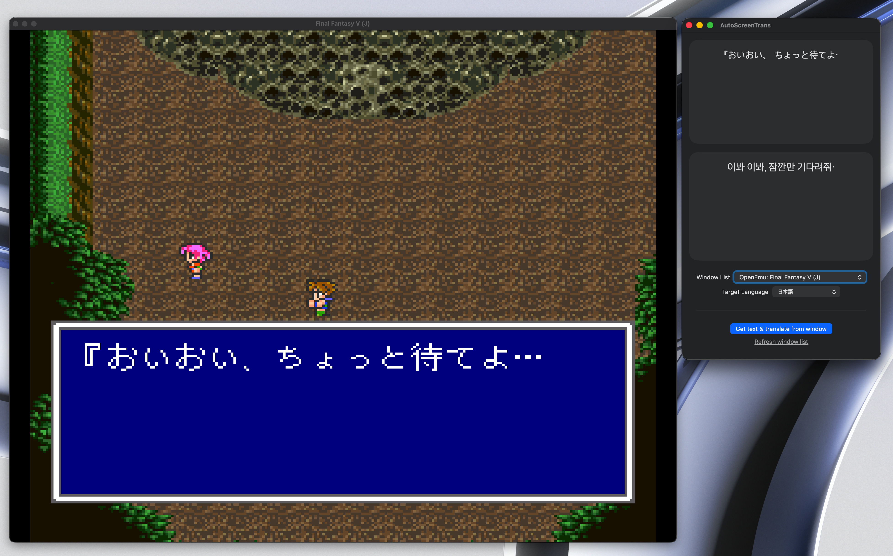

# AutoScreenTrans

A lightweight macOS desktop application that captures on-screen text via OCR and translates it in real time using local AI models.



## Key Features
- **Screen Capture & OCR**: Select any area on your screen to automatically extract text.
- **Local AI Translation**: Powered by MLX and Qwen 2.5 3B for fast, accurate, and private on-device translations.

---

## Requirements & Prerequisites

This application runs the **Qwen 2.5 3B Instruct (4-bit)** model locally on Apple Silicon using Apple's MLX framework. Follow the steps below to set up the environment.

### 1. Install Homebrew

If you don't have Homebrew installed on your Mac, open **Terminal** and run:

```bash
/bin/bash -c "$(curl -fsSL https://raw.githubusercontent.com/Homebrew/install/HEAD/install.sh)"
```

### 2. Install Python & Hugging Face CLI

Use Homebrew to install Python and `hf` :

```bash
# Install Python and Git LFS via Homebrew
brew install python git-lfs

# Install Hugging Face Hub CLI
brew install hf
```

---

## Model Download Instructions

To use local translation, you need to download the quantized model weights from Hugging Face (`mlx-community/Qwen2.5-3B-Instruct-4bit`).

1. Open your **Terminal**.
2. Run the following command to download the model to your preferred directory (or default Hugging Face cache):

```bash
hf download mlx-community/Qwen2.5-3B-Instruct-4bit
```

**Tip:** If you want to download the model directly into a specific folder inside your project or application data folder, use the `--local-dir` option:
```bash
hf download mlx-community/Qwen2.5-3B-Instruct-4bit --local-dir ./models/Qwen2.5-3B-Instruct-4bit
```

---

## Quick Start

1. Clone this repository:
```bash
git clone https://github.com/hellotunamayo/AutoScreenTrans.git
```
2. Open this project in XCode.
2. Build and launch **AutoScreenTrans**.
